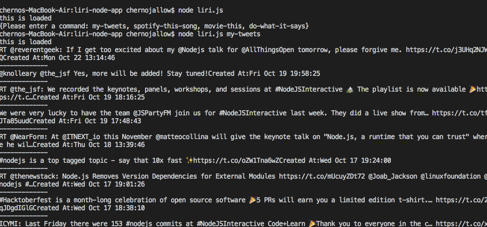
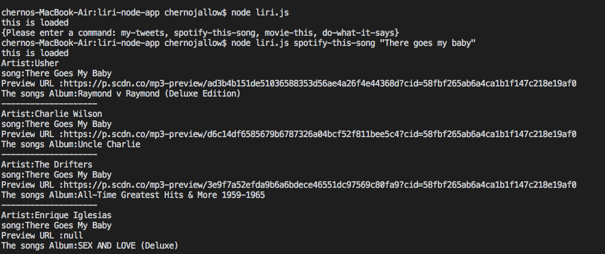
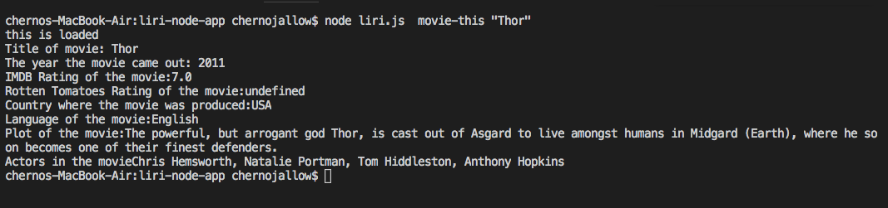
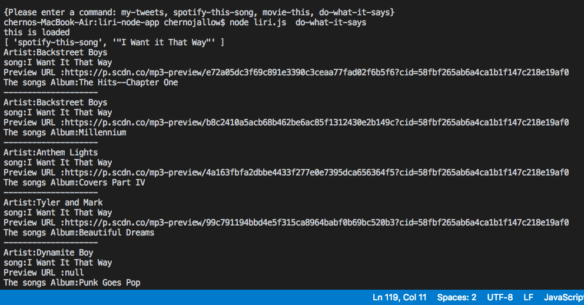

# liri-node-app
LIRI is a Language Interpretation and Recognition Interface. LIRI will be a command line node app that takes in parameters and gives you back data.

# node liri.js my-tweets
This will show your last 20 tweets and when they were created at in your terminal/bash window.

# node liri.js spotify-this-song '<song name here>'

This will show the following information about the song in your terminal/bash window

-Artist(s)
-The song's name
-A preview link of the song from Spotify
-The album that the song is from

# node liri.js movie-this '<movie name here>'

This will output the following information to your terminal/bash window:

   * Title of the movie.
   * Year the movie came out.
   * IMDB Rating of the movie.
   * Rotten Tomatoes Rating of the movie.
   * Country where the movie was produced.
   * Language of the movie.
   * Plot of the movie.
   * Actors in the movie.

# node liri.js do-what-it-says

Using the fs Node package, LIRI will take the text inside of random.txt and then use it to call one of LIRI's commands.

It should run spotify-this-song for "I Want it That Way," as follows the text in random.txt.

#Technologies used: Node.js, Javascript,
